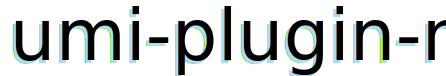

<h1 align="center">
  
</h1>

<p align="center">😍 优雅地使用 <code>mobx-state-tree</code> 响应式数据流生态来整合<code>umi</code>.</p>

<div align="center">

[](https://npmjs.org/package/umi-plugin-mobx)
[](https://npmjs.org/package/umi-plugin-mobx)

</div>

> [Docs English version](./README.md)

## ✨ Features

- 使用状态树节点自动包裹路由组件（通过高阶组件形式），提供页面纬度的数据状态流。
- 通过封装`umi/dynamic`动态加载状态树节点。
- Redux是不是写的很烦？快来试试Mobx和其最佳实践`mobx-state-tree`，开箱即用。
- 模型解析规则和`umi-plugin-dva`一致，你只需要默认导出一个状态树节点实例即可。

## 🚀 Install

```bash
yarn add umi-plugin-mobx
```

## 🛠 Usage

### Add plugin

在`.umirc.js`文件中添加该插件，注意`umi`会自动读取`stores`文件夹作为路由（`stores`文件夹名字可自定义），为了跳过它，使用`umi-plugin-routes`来进行相应配置。

安装 `umi-plugin-routes`.
```bash
yarn add umi-plugin-routes
```

```js
// .umirc.js

export default {
  plugins: [
    ['umi-plugin-mobx', {
      modelName: 'store', // 或者写复数形式皆可 "stores", 默认值为 "store", 你也可以像使用dva一样命名为 "model"。
      exclude: [/^\$/, (filename) => filename.includes('__')]
    }],
    ['umi-plugin-routes', {
      exclude: [/stores/] // 忽略目录 **/stores/**/*.*, 你也可以像使用dva一样设置为 /models/ 。
    }]
  ]
}
```

```bash
yarn add umi-plugin-routes
```

**[不建议]** 你也通过目录下的 `page.jsx` 或 `page.tsx` 文件来跳过 `umijs` 的目录解析。

- 插件配置选项
```ts
interface PluginOptions {
  modelName?: string;
  exclude?: Excludes;
}

type Excludes = (RegExp | TestFn)[];
type TestFn = (filename: string) => boolean;
```

### Config mobx

Mobx [config documents](https://github.com/mobxjs/mobx/blob/gh-pages/docs/refguide/api.md#configure)
```js
// src/mobx.ts
// 或者 src/mobx.js
export function config() {
  return {
    enforceActions: true // 或者设置为 'strict' 来启用严格模式
  };
}
```

## 📦 Examples

- [Example:user-dashboard](./examples/user-dashboard) (推荐)
- [Example:simple](./examples/simple)

### 如何运行示例？

如果你想跑起来 user-dashboard...
```bash
git clone https://github.com/HeskeyBaozi/umi-plugin-mobx
cd umi-plugin-mobx
yarn install
yarn link
cd examples/user-dashboard
yarn install
yarn link "umi-plugin-mobx"
yarn start
```

`Mobx`状态数例子:
```ts
// examples/user-dashboard/src/pages/users/stores/users.ts
// 类似dva的model
// dva 版: https://github.com/umijs/umi-dva-user-dashboard/blob/master/src/pages/users/models/users.js

import { AxiosResponse } from 'axios';
import { applyAction, flow, types } from 'mobx-state-tree';
import { Loading } from '../../../stores/$loading';
import { $ } from '../../../utils';
import { User } from './$user';

const Users = types
  .compose(Loading, types.model({
    list: types.array(User),
    total: types.maybe(types.number),
    page: types.maybe(types.number)
  }))
  .named('users')
  .volatile((self) => {
    return {
      PAGE_SIZE: 5
    };
  })
  .actions((self) => {
    return {
      fetchAsync: flow(function* fetchAsync({ page }: { page: number }) {
        const { data, headers }: AxiosResponse<any[]> = yield $.get(`/users?_page=${page}&_limit=${self.PAGE_SIZE}`);
        self.list.clear();
        self.list.push(...data);
        self.total = Number.parseInt(headers['x-total-count']);
        self.page = page;
      }),
      removeAsync: flow(function* removeAsync({ id }: { id: number }) {
        yield $.delete(`/users/${id}`);
      }),
      updateAsync: flow(function* updateAsync({ id, values }: { id: number, values: object }) {
        yield $.patch(`/users/${id}`, JSON.stringify(values));
      }),
      createAsync: flow(function* createAsync({ values }: { values: object }) {
        yield $.post(`/users`, JSON.stringify(values));
      })
    };
  });

export type UsersType = typeof Users.Type;
export default Users.create({
  list: [],
  total: null
});
```
